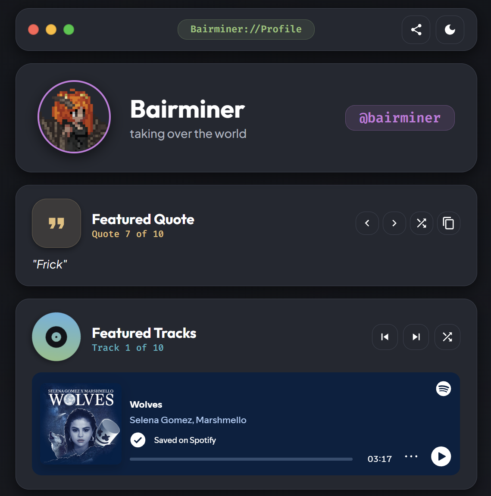

# Bairminer // Profile Index

A premium, interactive link-in-bio webpage styled in **Atom One Dark** aesthetics with Material Design 3, macOS window controls, Steam showcase popovers, randomized quote & music widgets, dynamic SVG mask tinting, and cool animations.



Remake of my previous [Linktree page project](https://github.com/Bairminer/Linktree).

---

## Features

- **Atom One Dark Color Palette**: Tailored syntax-highlighted color tokens featuring Atom Blue (`#61afef`), Atom Purple (`#c678dd`), Atom Green (`#98c379`), Atom Red (`#e06c75`), Atom Orange (`#d19a66`), and Atom Yellow (`#e5c07b`).
- **Interactive macOS Window Controls**: Functional control dots on the top bar:
  - **Red (Close)**: Toggles *Profile Only* mode (collapses lower widgets & link cards).
  - **Yellow (Minimize)**: Toggles *Widgets Only* mode (shows Profile, Quote, & Music player).
  - **Green (Maximize)**: Restores *Full View* (shows all cards and links).
- **Top Bar Badge**: A 3-column CSS Grid top navigation bar with a clickable tag.
- **Steam Showcase Popover**: Hovering or clicking the profile avatar opens a live Steam mini-profile showcase popover with click-to-pin and click-outside dismissal.
- **Randomized Quote Generator**: Auto-selects a random quote on initial page load, complete with previous, next, shuffle, and copy-to-clipboard controls.
- **Randomized Spotify Music Player**: Auto-selects a random track on load, featuring a spinning vinyl record animation, track artist counter, prev/next controls, and an embedded Spotify player.
- **Dynamic SVG Mask Accent Tinting**: Dynamically tints social link icons (Steam, YouTube, Spotify, Reddit, Instagram, X/Twitter, Pinterest, Twitch, Imgur, Tumblr) and badge tags to their exact accent hex colors using CSS mask tinting.
- **Instant Search Filter**: Real-time client-side search filtering across link names, subtitles, and badges.
- **Cursor-Tracking Spotlight Glow**: Subtle radial spotlight follow effect on mouseover across all cards and top bar.
- **High-Contrast Dark / Light Theme Toggle**: Seamless theme switcher with tailored slate/dark surface contrast tokens.
- **Custom Favicon Suite**: Includes multi-size `favicon.ico`, `favicon-32x32.png`, and `apple-touch-icon.png` generated from the profile avatar.

---

## Quick Start

No complex build steps, bundlers, or npm dependencies required! Built with standard Vanilla HTML5, CSS3, and ES6+ JavaScript.

### 1. Run Locally

#### Using Python (Built-in)
```bash
# Navigate to project directory
cd profile-index

# Launch local server
python -m http.server 8080
```
Open **[http://localhost:8080](http://localhost:8080)** in your browser.

#### Using Node.js / npx
```bash
npx serve profile-index
```

---

## How to Customize (If You Fork This Repo)

Customizing the profile for your own identity is fast and straightforward. All content is modularized in `data.js`, `index.html`, and `styles.css`.

### 1. Update Profile & Social Links (`data.js`)

Open `data.js` to modify profile info, quotes, music tracks, and link cards:

```javascript
// Profile Information
const profileData = {
  name: "Your Name",
  desc: "Your custom bio description",
  handle: "@yourhandle",
  avatar: "assets/images/profile.png",
  website: "https://yourwebsite.com"
};

// Featured Quotes List
const quotes = [
  "Your custom quote 1.",
  "Your custom quote 2.",
];

// Spotify Tracks List
const songs = [
  {
    title: "Track Title",
    artist: "Artist Name",
    embed: "https://open.spotify.com/embed/track/YOUR_TRACK_ID?utm_source=generator&theme=0"
  }
];

// Link Cards List (Icon, Accent Color & Badge)
const linkData = [
  {
    id: 1,
    link: "https://github.com/yourusername",
    name: "GitHub",
    subtitle: "Code Repositories & Projects",
    icon: "assets/icons/github.svg",
    badge: "Code",
    accent: "#61afef" // Accent Hex Color
  }
];
```

### 2. Update Page Titles & Branding (`index.html`)

Open `index.html` to update the document title, OpenGraph meta tags, and top bar brand link:

```html
<!-- SEO & OpenGraph Titles -->
<title>YourName://Profile</title>
<meta property="og:title" content="YourName://Profile" />

<!-- Top Bar Brand Badge Link -->
<a href="https://yourwebsite.com" target="_blank" rel="noopener noreferrer" class="brand-badge" title="Visit yourwebsite.com">
  <span>YourName://Profile</span>
</a>
```

### 3. Update Steam Showcase Popover (`index.html`)

To show your own Steam mini-profile in the popover, update the iframe `src` in `index.html`:

```html
<iframe
  id="steamEmbed"
  src="https://gamer2810.github.io/steam-miniprofile/?accountId=YOUR_STEAM_ACCOUNT_ID&appId=427520&interactive=true&vanityId=YOUR_VANITY_ID&centered=true"
  title="Steam Mini-Profile"
  height="320"
  scrolling="no"
  loading="lazy">
</iframe>
```

### 4. Customizing Theme Colors (`styles.css`)

Color tokens are controlled via CSS variables in `styles.css`. You can adjust Atom syntax colors or surface contrast levels:

```css
:root {
  --atom-bg-dark: #121418;
  --atom-bg-panel: #1b1e24;
  --atom-blue: #61afef;
  --atom-purple: #c678dd;
  --atom-green: #98c379;
  --atom-red: #e06c75;
  --atom-orange: #d19a66;
  --atom-yellow: #e5c07b;
}
```

---

## Project Structure

```
profile-index/
├── assets/
│   ├── icons/            # SVG social media icons
│   └── images/           # Profile avatar & favicon assets
├── app.js                # Event handlers, theme toggle, popovers & window view modes
├── data.js               # Dynamic links, quotes, songs, and profile configuration
├── index.html            # Main HTML layout
├── styles.css             # Atom One Dark stylesheet & responsive rules
├── favicon.ico           # Multi-resolution browser icon
├── favicon-32x32.png     # PNG favicon
└── README.md
```

---

## License

Distributed under the MIT License. Feel free to fork, customize, and build your own index page!
